# Vim no color collections

A list of Vim colorschemes with barely any colors. Go ahead, compare and
**contrast**.

### [andreasvc/vim-256noir](https://github.com/andreasvc/vim-256noir)

> A dark 256-color color scheme for vim.
>
> Have you ever wondered why most syntax highlighting of source code is about as
> subtle and pretty as a candy shop explosion? A technical reason is the
> historical constraints imposed by 16 color terminals, but fortunately this
> limitation is easy to overcome.

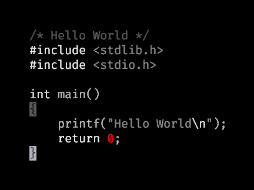

### [Alligator/accent.vim](https://github.com/Alligator/accent.vim)

> A vim colourscheme with a configurable accent colour. It can help you quickly
> tell apart different vim sessions at a glance.

### [plan9-for-vimspace/acme-colors](https://github.com/plan9-for-vimspace/acme-colors)

> acme colors for vim.

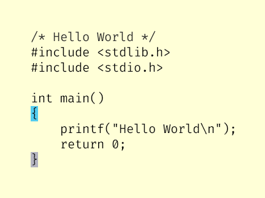

### [huyvohcmc/atlas.vim](https://github.com/huyvohcmc/atlas.vim)

> Probably the purest black and white vim colorscheme you can find on the
> internet.

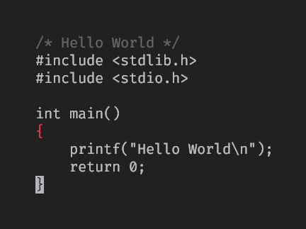

### [LuRsT/austere.vim](https://github.com/LuRsT/austere.vim)

> Severe or stern in disposition or appearance; somber and grave\_

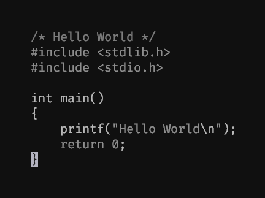

### [chriskempson/base16-vim](https://github.com/chriskempson/base16-vim)

> See the [Base16 repository](https://github.com/chriskempson/base16) for more
> information.

- [Dark](https://github.com/chriskempson/base16-vim/blob/master/colors/base16-grayscale-dark.vim)
- [Light](https://github.com/chriskempson/base16-vim/blob/master/colors/base16-grayscale-light.vim)

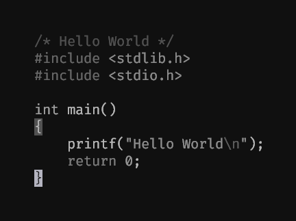
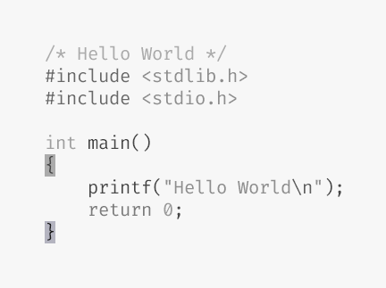

### [t184256/vim-boring](https://github.com/t184256/vim-boring)

> a truly boring monochrome colorscheme for vim, inspired by 'noclown'.

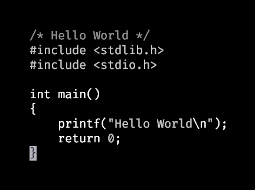

### [~romainl/vim-bruin](https://git.sr.ht/~romainl/vim-bruin)

> A Vim colorscheme with just enough color to deserve its job title.
>
> - should use colors _only_ for UI-related highlight groups
> - should _only_ use combinations of **b**old, **r**everse, **u**nderline,
>   **i**talic, and **N**ONE for syntax-related highlight groups
> - should work the same on _light_ and _dark_ background without human
>   intervention

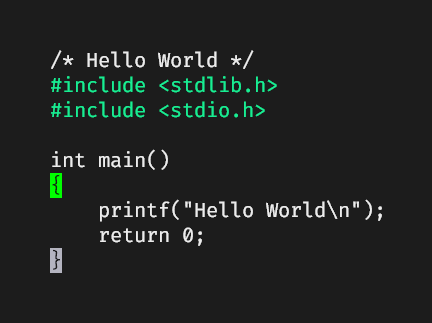

### [aditya-azad/candle-grey](https://github.com/aditya-azad/candle-grey)

> A dark monochrome grey colorscheme for vim with a simple accent color.

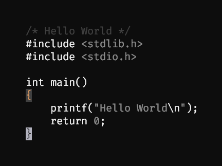
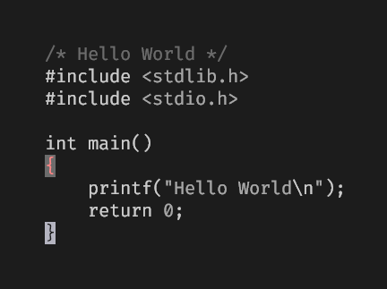

### [davidosomething/vim-colors-meh](https://github.com/davidosomething/vim-colors-meh)

> > A 256-color / 24-bit Vim color scheme, with preference for contrast over
> > hues.
>
> It works for me, just publishing it in case someone has similar taste and
> wants to use it.

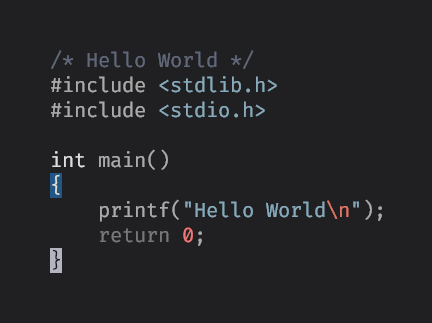

### [pbrisbin/vim-colors-off](https://github.com/pbrisbin/vim-colors-off)

> For a number of weeks, I ran vim with `syntax off`. It was quite nice, with
> only two annoyances:
>
> - Bright white on jet black was a bit off-putting.
> - There were cases when I did miss the lack of color, vimdiff for example.
>
> Therefore, I aimed to find or create a colorscheme to solve these two issues.
>
> The result is very much based on the [pencil][] colorscheme, which is
> surprising because it's a very colorful colorscheme, but:
>
> - It uses a very sane approach to defining and setting colors
> - It has nice background and foreground colors
> - In the areas where I do want color, I like how it colors things

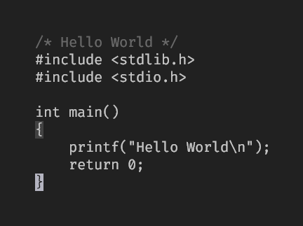

### [andreypopp/vim-colors-plain](https://github.com/andreypopp/vim-colors-plain)

> Minimalistic colorscheme which uses bold to highlight keywords and a
> distinguished color for constant literals (string, numbers, JSX tags).

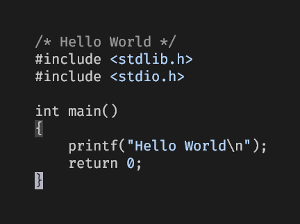
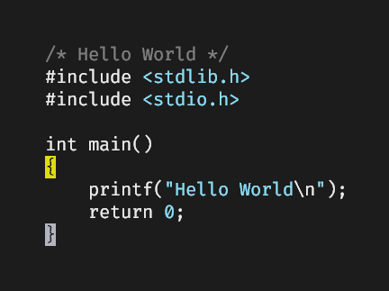

### [owickstrom/vim-colors-paramount](https://github.com/owickstrom/vim-colors-paramount)

> A minimal colorscheme for Vim that only puts emphasis on the paramount.

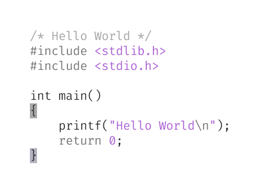

### [reedes/vim-colors-pencil](https://github.com/reedes/vim-colors-pencil)

> A light (and dark) color scheme for Vim inspired by iA Writer

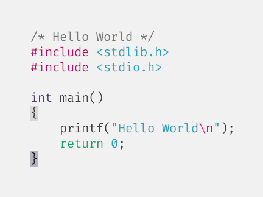

### [Jorengarenar/vim-darkness](https://github.com/Jorengarenar/vim-darkness)

> Simple monochrome Vim colorscheme focused on indulgeing into the darkness

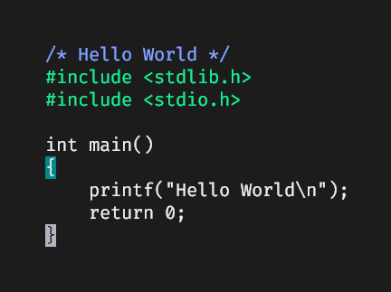

### [KKPMW/distilled-vim](https://github.com/KKPMW/distilled-vim)

> Clears up syntax highlighting to reveal what is important.

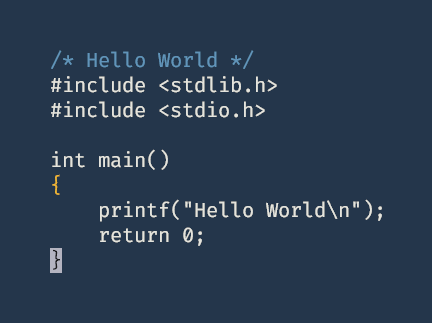

### [jaredgorski/fogbell.vim](https://github.com/jaredgorski/fogbell.vim)

> Fogbell is a fork of [SpaceCamp](https://github.com/jaredgorski/SpaceCamp)
> minus color. It comes with only comments, diff, and hlsearch differentiated
> out of the box, but the files are easy to edit if you need more (or less)
> distinction. No bold or italics. Fogbell includes dark, low-contrast, and
> light variants.

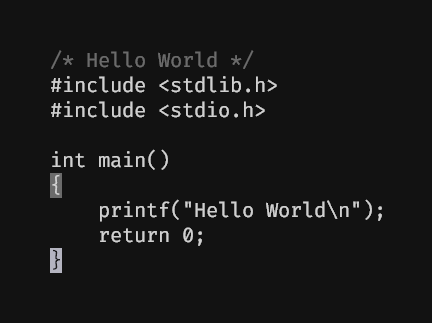

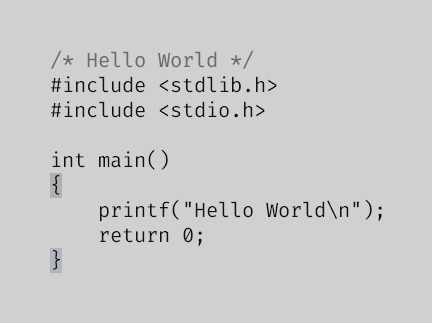

### [zekzekus/menguless](https://github.com/zekzekus/menguless)

> A color scheme inspired by a very nice rogue like game design.

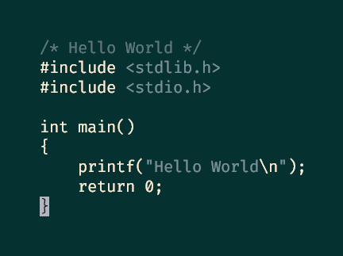
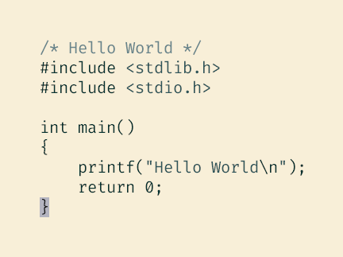

### [fxn/vim-monochrome](https://github.com/fxn/vim-monochrome)

> A dark Vim color scheme for your focused hacking session.

### [koron/vim-monochromenote](https://github.com/koron/vim-monochromenote)

> monochromenote is inspired by KOKUYO's awesome notebook.

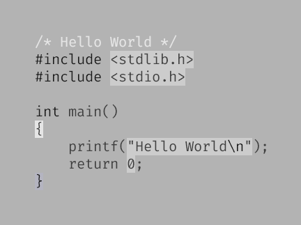

### [Lokaltog/vim-monotone](https://github.com/Lokaltog/vim-monotone)

> Another monochrome vim colorscheme. Inspired by various
> [other](https://github.com/ewilazarus/preto) >
> [monochrome](https://github.com/pbrisbin/vim-colors-off) >
> [colorschemes](https://github.com/fxn/vim-monochrome).
>
> Monotone is a middle ground between a regular colorscheme and
> [no syntax highlighting at all](https://www.kyleisom.net/blog/2012/10/17/syntax-off/).
> The colorscheme differentiates comments, strings and keywords with different
> weights and shades of gray. It emphasizes errors, warnings and search
> highlighting as shown in the screenshots below.

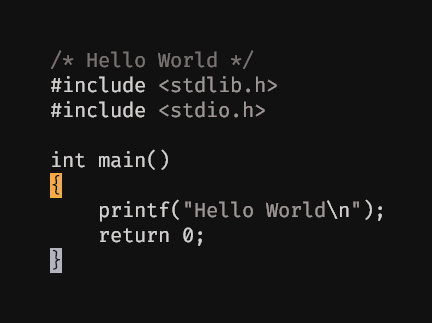

### [bdd/noclown.vim](https://github.com/bdd/.dotfiles/blob/master/dot.config/vim/colors/noclown.vim)

> A mostly color free theme with a goal of not making your code look like a
> clown threw up.

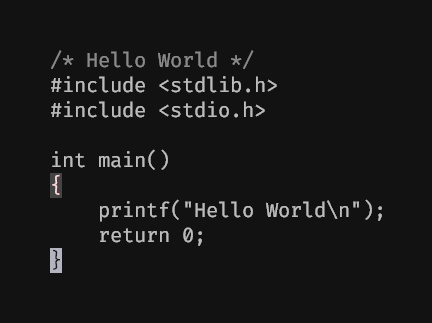

### [robertmeta/nofrils](https://github.com/robertmeta/nofrils)

> An extremely minimalist colorscheme, even opting out of the second L in
> frills.

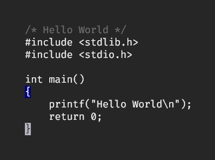
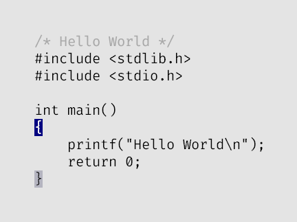
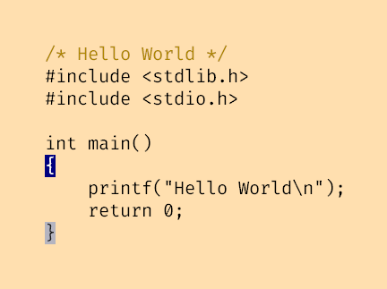
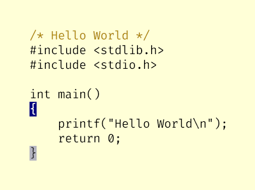

### [n1ghtmare/noirblaze-vim](https://github.com/n1ghtmare/noirblaze-vim)

> A dark minimal vim theme with a touch of hot pink (magenta?).

### [YorickPeterse/vim-paper](https://github.com/YorickPeterse/vim-paper)

> A personal light theme for (Neo)Vim, based on the color of paper as found in
> various notebooks.

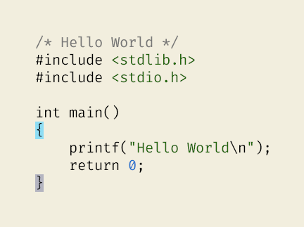

### [ajgrf/parchment](https://github.com/ajgrf/parchment)

> Parchment is an editor theme for Vim and Emacs, inspired by Acme and Leuven.
> You might like it if you prefer light colorschemes but think black-on-white is
> too hard on your eyes, or if you find most colorschemes too busy.

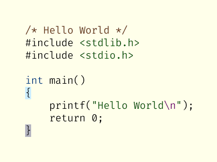

### [widatama/vim-phoenix](https://github.com/widatama/vim-phoenix)

> Monochrome Vim color scheme based on Phoenix.

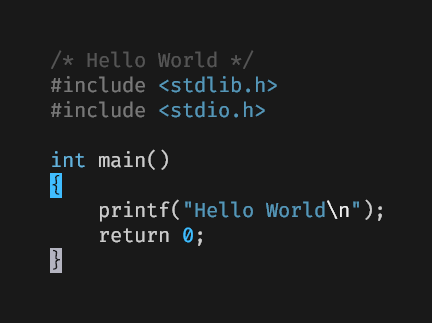

### [axvr/photon.vim](https://github.com/axvr/photon.vim)

> Photon is a low-contrast colour scheme, which cares about the little details.
> It is based on an old version of
> [paramount](https://github.com/owickstrom/vim-colors-paramount) and is
> designed to look exactly the same on 256 colour terminals as it does on true
> colour terminals.

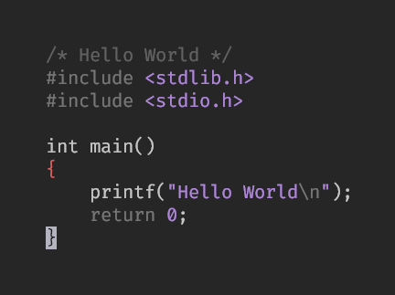
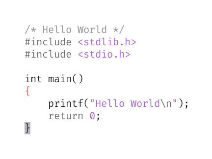

### [ewilazarus/preto](https://github.com/ewilazarus/preto)

> A minimal dark color scheme for VIM, inspired by badwolf and 256_noir.

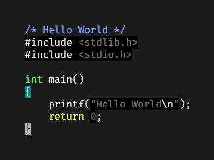

### [stefanvanburen/rams.vim](https://github.com/stefanvanburen/rams.vim)

> A minimal vim colorscheme, inspired by the work of Dieter Rams.

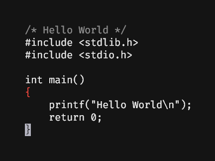

### [kadekillary/skull-vim](https://github.com/kadekillary/skull-vim)

> ☠️ Minimal monochrome theme for vim.

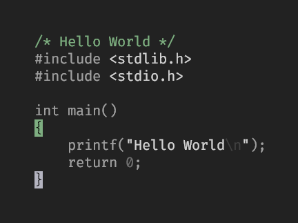

### [nikolvs/vim-sunbather](https://github.com/nikolvs/vim-sunbather)

> A minimal pink colorscheme for Vim.

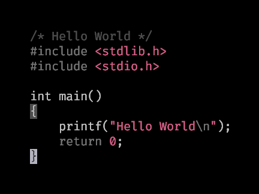

### [ryanpcmcquen/true-monochrome_vim](https://github.com/ryanpcmcquen/true-monochrome_vim)

> This is a true black/grey/white theme for vim. I would say it is as close as I
> have seen to what the original vi editors looked like (think elvis).

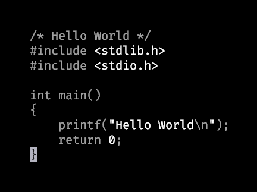

### [hardselius/warlock](https://github.com/hardselius/warlock)

> Warlock is a dark, low-contrast, grayscale colorscheme for Vim based on the
> awesome [Apprentice](https://github.com/romainl/Apprentice) by Romain
> Lafourcade.

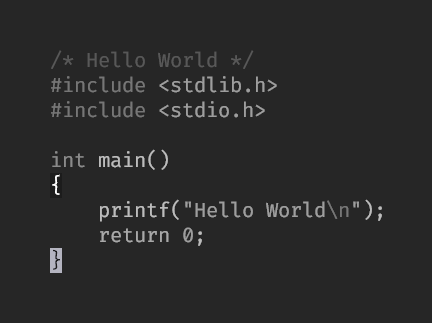

### [pgdouyon/vim-yin-yang](https://github.com/pgdouyon/vim-yin-yang)

> Yin-Yang is a black and white color scheme for Vim and is heavily inspired by
> [preto][] and [base16-grayscale][].
>
> I liked preto's subtle use of colors in a black/white colorscheme but found
> the contrast too high for my liking, so I created Yin-Yang as a low contrast
> version of preto.

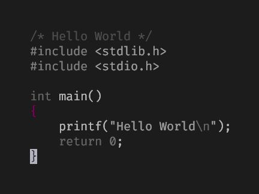
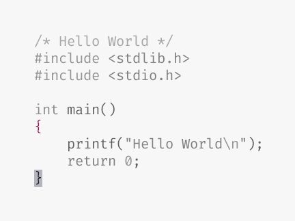

### [danishprakash/vim-yami](https://github.com/danishprakash/vim-yami)

> Monochromatic dark(闇) theme for Vim

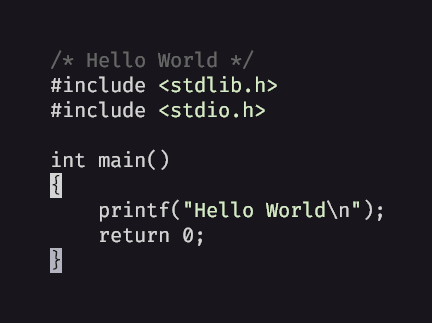

### [cideM/yui](https://github.com/cideM/yui)

> Experimental color scheme without any colors, except what's required to
> display a meaningful `diff`. All syntax differentiation is achieved through
> font styles, so your terminal needs to support bold and italic text.
>
> Shades are used for things like dimming folded text.

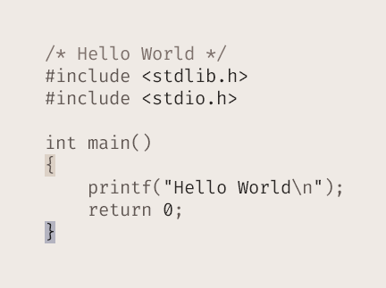

### [zaki/zazen](https://github.com/zaki/zazen)

> zazen vim color scheme (a personalized version of zenesque).

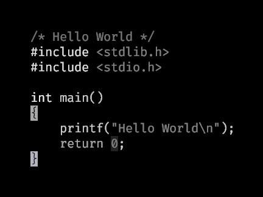

### [mcchrish/zenbones.nvim](https://github.com/mcchrish/zenbones.nvim)

> Zenbones is a collection of vim/neovim colorschemes designed to highlight code
> using contrasts and font variations. Colors are tasked only for other roles
> such as diagnostics, diffs, search matches.

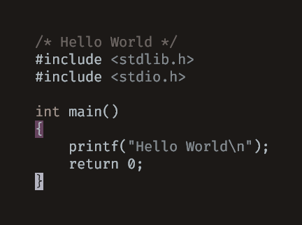
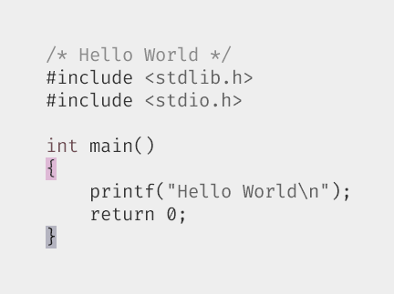
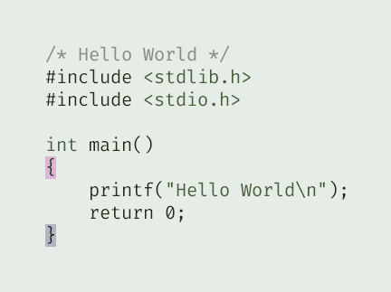
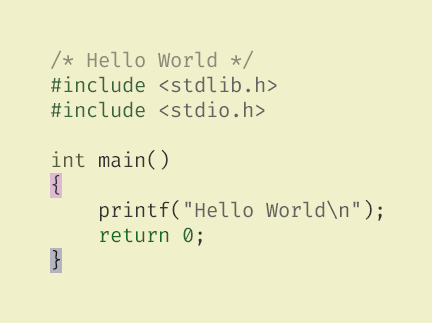

### [zenesque.vim](https://github.com/vim-scripts/zenesque.vim)

> Almost colorless(shades of grey), light minimalistic color scheme.  Designed
> for reading for long periods. Inspired by Mini.

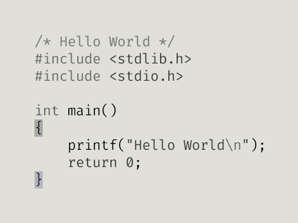

#### Add some more!

Send a Pull Request to add more color (or lack there of) themes!

[preto]: https://github.com/ewilazarus/preto
[base16-grayscale]: https://github.com/chriskempson/base16-vim
[paramount]: https://github.com/owickstrom/vim-colors-paramount
[off]: https://github.com/reedes/vim-colors-off
[pencil]: https://github.com/reedes/vim-colors-pencil
